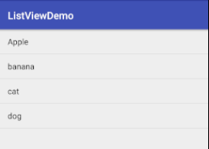
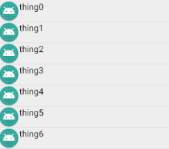

# android listview with image and text

# adapter/ ArrayAdapter = 绑定单一数据,如集合或数组

```java
private ListView listView;
private ArrayAdapter<String> arrayAdapter;

@Override
protected void onCreate(Bundle savedInstanceState) {
    super.onCreate(savedInstanceState);
    setContentView(R.layout.activity_main);
    // 1. acquire ListView
    listView = findViewById(R.id.list_view);
    // 2. acquire Datasource
    String[] arrayData = {"Apple", "banana", "cat", "dog"};
    // 3. create Adapter
    /**
     * parameter
     * @context this
     * @LayoutResources xml View To display data
     * @Resources data source
     */
    arrayAdapter = new ArrayAdapter<String>(this, android.R.layout.simple_list_item_1, arrayData);
    // 4. attach datasource To View
    listView.setAdapter(arrayAdapter);
}
```

# adapter/ SimpleAdapter = 绑定格式复杂的数据,只能泛型集合

```java
    private ListView simpleListView;
    private SimpleAdapter simpleAdapter;
    private List<Map<String,Object>> datalist;

    @Override
    protected void onCreate(Bundle savedInstanceState) {
        super.onCreate(savedInstanceState);
        setContentView(R.layout.activity_main);
        // 1. acquire ListView
        simpleListView = findViewById(R.id.simple_list_view);
        // 2. acquire Datasource
        datalist = new ArrayList<Map<String, Object>>();
        // 3. create Adapter
        /**
         * parameters
         * @context
         * @data datasource a key-value map
         * @resource Layout
         * @map key in the map
         * @to id in the View
         */
        simpleAdapter = new SimpleAdapter(this,
                getData(),
                R.layout.item,
                new String[]{"pic","text"},
                new int[]{R.id.pic, R.id.text});
        // 4. attach datasource To View
        simpleListView.setAdapter(simpleAdapter);
    }

    private List<Map<String, Object>> getData() {
        for(int i=0;i<20;i++) {
            Map<String, Object> map = new HashMap<String,Object>();
            map.put("pic", R.mipmap.ic_launcher_round);
            map.put("text", "thing" + i);
            datalist.add(map);
        }
        return datalist;
    }
```

# Listener/ OnItemListener = 单个条目点击
```java
public class MainActivity extends AppCompatActivity implements AdapterView.OnItemClickListener,AbsListView.OnScrollListener {

    private ListView simpleListView;

    @Override
    protected void onCreate(Bundle savedInstanceState) {
        super.onCreate(savedInstanceState);
        setContentView(R.layout.activity_main);

        simpleListView = findViewById(R.id.simple_list_view);

        simpleListView.setOnItemClickListener(this);
        simpleListView.setOnScrollListener(this);
    }

    @Override
    public void onItemClick(AdapterView<?> adapterView, View view, int position, long id) {
        String text = simpleListView.getItemAtPosition(position) + "";
        Toast.makeText(this,"position"+position+" text="+text, Toast.LENGTH_SHORT).show();
    }
}
```
# listener/ OnScrollListener = 滚动list触发
```java
public class MainActivity extends AppCompatActivity implements AdapterView.OnItemClickListener,AbsListView.OnScrollListener {

    private ListView simpleListView;
    private SimpleAdapter simpleAdapter;
    private List<Map<String,Object>> datalist;

    @Override
    protected void onCreate(Bundle savedInstanceState) {
        super.onCreate(savedInstanceState);
        setContentView(R.layout.activity_main);

        simpleListView.setOnScrollListener(this);
    }

    @Override
    public void onScrollStateChanged(AbsListView absListView, int scrollState) {
        switch (scrollState) {
            case SCROLL_STATE_FLING:
                Log.i("Main", "用户在手指离开屏幕后,屏幕惯性滑动");
                Map<String,Object> map = new HashMap<String,Object>();
                map.put("pic", R.mipmap.ic_launcher_round);
                map.put("text", "add item");
                datalist.add(map);
                simpleAdapter.notifyDataSetChanged();
                break;
            case SCROLL_STATE_IDLE:
                Log.i("Main", "停止滚动");
                break;
            case SCROLL_STATE_TOUCH_SCROLL:
                Log.i("Main", "触屏滑动");
                break;
        }
    }
}
```
