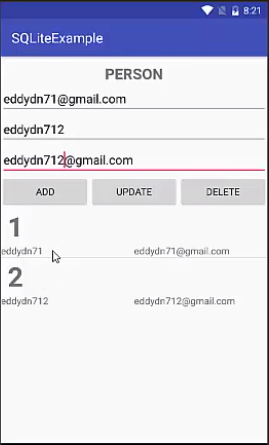

# Android SQLite Example 2017


# Environment
Mini SDK: API 19 - Android 4.4

# keypoint
- DatabaseHelper to manage data
- Person is the model
- PersonAdapter is to manage the display of list of persons at runtime 
- row.xml is the list view to show record

# adapater
adapter常用来管理数据。比如列表的数据，网格的数据。

```java
public class PersonAdapter extends BaseAdapter {
    Activity activity;
    List<Person> lstPersons;
    LayoutInflater inflater;
    EditText edtId, edtName, edtEmail;

    public PersonAdapter(Activity activity, List<Person> lstPersons, EditText edtId, EditText edtName, EditText edtEmail) {
        this.activity = activity;
        this.lstPersons = lstPersons;
        inflater = (LayoutInflater)activity.getSystemService(Context.LAYOUT_INFLATER_SERVICE);
        this.edtId = edtId;
        this.edtName = edtName;
        this.edtEmail = edtEmail;
    }

    @Override
    public int getCount() {
        return lstPersons.size();
    }

    @Override
    public Object getItem(int i) {
        return lstPersons.get(i);
    }

    @Override
    public long getItemId(int i) {
        return lstPersons.get(i).getId();
    }

    @Override
    public View getView(int i, View convertView, ViewGroup parent) {
        View rowView;
        rowView=inflater.inflate(R.layout.row, null);
        final TextView txtRowId,txtRowName,txtRowEmail;
        txtRowId = (TextView) rowView.findViewById(R.id.txtRowId);
        txtRowName = (TextView) rowView.findViewById(R.id.txtRowName);
        txtRowEmail = (TextView) rowView.findViewById(R.id.txtRowEmail);

        txtRowId.setText(""+lstPersons.get(i).getId());
        txtRowName.setText(""+lstPersons.get(i).getName());
        txtRowEmail.setText(""+lstPersons.get(i).getEmail());

        rowView.setOnClickListener(new View.OnClickListener(){
            @Override
            public void onClick(View v) {
                edtId.setText(""+txtRowId.getText());
                edtName.setText(""+txtRowName.getText());
                edtEmail.setText(""+txtRowEmail.getText());
            }
        });

        return rowView;
    }
}
```


# inflater/layoutInflater = 获取layout下的xml文件
https://zhidao.baidu.com/question/2205143519905210068.html
在实际开发中LayoutInflater这个类还是非常有用的，它的作用类似于findViewById()。不同点是LayoutInflater是用来找res/layout/下的xml布局文件，并且实例化；而findViewById()是找xml布局文件下的具体widget控件(如Button、TextView等)。
具体作用：
1. 对于一个没有被载入或者想要动态载入的界面，都需要使用LayoutInflater.inflate()来载入；
2. 对于一个已经载入的界面，就可以使用Activiyt.findViewById()方法来获得其中的界面元素。

```java
LayoutInflater inflater;

public View getView(int i, View convertView, ViewGroup parent) {
    View rowView;
    rowView=inflater.inflate(R.layout.row, null);
    final TextView txtRowId,txtRowName,txtRowEmail;
    txtRowId = (TextView) rowView.findViewById(R.id.txtRowId);
    txtRowName = (TextView) rowView.findViewById(R.id.txtRowName);
    txtRowEmail = (TextView) rowView.findViewById(R.id.txtRowEmail);

    txtRowId.setText(""+lstPersons.get(i).getId());
    txtRowName.setText(""+lstPersons.get(i).getName());
    txtRowEmail.setText(""+lstPersons.get(i).getEmail());

    rowView.setOnClickListener(new View.OnClickListener(){
        @Override
        public void onClick(View v) {
            edtId.setText(""+txtRowId.getText());
            edtId.setText(""+txtRowName.getText());
            edtId.setText(""+txtRowEmail.getText());
        }
    });

    return rowView;
}
```

# SQLiteOpenHelper/example
```java
public class DatabaseHelper extends SQLiteOpenHelper{
    //database
    private static final int DATABASE_VER=1;
    private static final String DATABASE_NAME="EMDTDev";

    //table
    private static final String TABLE_NAME="Persons";
    private static final String KEY_ID="Id";
    private static final String KEY_NAME="Name";
    private static final String KEY_EMAIL="Email";

    public DatabaseHelper(Context context, String name, SQLiteDatabase.CursorFactory factory, int version) {
        super(context, DATABASE_NAME, null, DATABASE_VER);
    }

    @Override
    public void onCreate(SQLiteDatabase db) {
        String CREATE_TABLE = "CREATE TABLE"+TABLE_NAME+"("
                +KEY_ID+" INTEGER PRIMARY KEY,"
                +KEY_NAME+" TEXT"
                +KEY_EMAIL+" TEXT"
                +")";
        db.execSQL(CREATE_TABLE);
    }

    @Override
    public void onUpgrade(SQLiteDatabase db, int oldVersion, int newVersion) {
        db.execSQL("DROP TABLE IF EXISTS "+TABLE_NAME);
        onCreate(db);
    }

    // CRUD Persons
    public void addPerson(Person person){
        SQLiteDatabase db = this.getWritableDatabase();
        ContentValues values = new ContentValues();
        values.put(KEY_NAME,person.getName());
        values.put(KEY_EMAIL,person.getName());

        db.insert(TABLE_NAME,null,values);
        db.close();
    }

    public int updatePerson(Person person){
        SQLiteDatabase db = this.getWritableDatabase();
        ContentValues values = new ContentValues();
        values.put(KEY_NAME,person.getName());
        values.put(KEY_EMAIL,person.getEmail());

        return db.update(TABLE_NAME,values,KEY_ID+" =?",new String[] {String.valueOf(person.getId())});
    }

    public void deletePerson(Person person){
        SQLiteDatabase db = this.getWritableDatabase();
        db.delete(TABLE_NAME,KEY_ID+" =?",new String[]{String.valueOf(person.getId())});
        db.close();
    }

    public Person getPerson(int id){
        SQLiteDatabase db = this.getWritableDatabase();
        Cursor cursor = db.query(
                TABLE_NAME,
                new String[]{KEY_ID, KEY_NAME, KEY_EMAIL},
                KEY_ID+"=?",
                new String[]{String.valueOf(id)},
                null,null,null,null);
        if(cursor != null)
            cursor.moveToFirst();
        return new Person(cursor.getInt(0), cursor.getString(1), cursor.getString(2));
    }

    public List<Person> getAllPerson(){
        List<Person> lstPersons = new ArrayList<>();
        String selectQuery = "SELECT * FROM "+ TABLE_NAME;
        SQLiteDatabase db = this.getWritableDatabase();
        Cursor cursor = db.rawQuery(selectQuery,null);
        if (cursor.moveToFirst()){
            do{
                Person person = new Person();
                person.setId(cursor.getInt(0));
                person.setName(cursor.getString(1));
                person.setEmail(cursor.getString(2));

                lstPersons.add(person);
            }
            while (cursor.moveToNext());
        }
        return lstPersons;
    }
}
```

# source
[Android Studio Tutorial - Working with SQLite](https://www.youtube.com/watch?v=4OagwZeiX4g)
