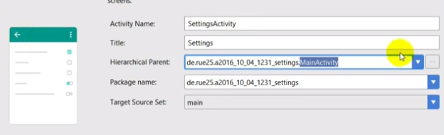
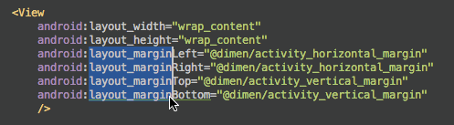
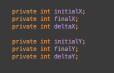
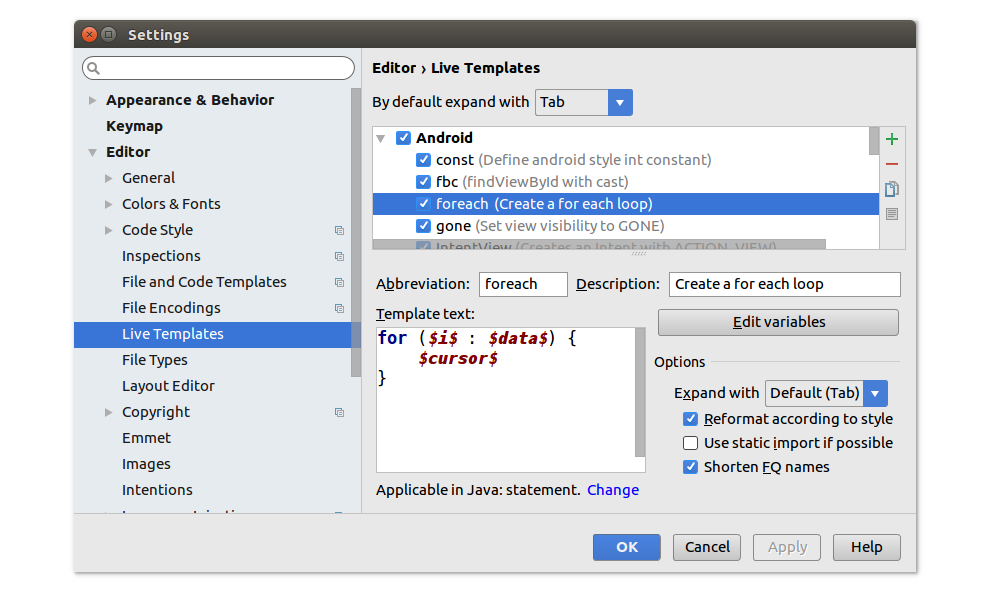

# Android Learning
Codes and examples of android applications.
2017-11-16 To

# working
https://www.youtube.com/results?search_query=android+constraintlayout+tutorial
https://www.youtube.com/results?search_query=android+modern+design

# test device = Samsung note3
1080X1920 pixels
Android 5.1.1, API 22
Galaxy Note III Released: 2013. Resolution: 1920×1080 5.7″ display. Full HD (FHD) 1920×1080
pixel density 386.47 PPI

# myfirstapp = intent
- This simplest example includes about how to transfer message between two activities;


# ReadFile = reading text file
[Read text file from assets folder in Android Studio](https://www.youtube.com/watch?v=1CHDASXojNQ)

# user interface hierarchy


# Settings and Preferences

[AS #35: Create Settings and Preferences @Android Studio](https://www.youtube.com/watch?v=jzpI9vdeV1A)

# sqliteQueryDemo = cursor to list to display data in sqlite database
# sqliteAdapter = use adapter to display data from sqlite database in external storage

# Adapter/ 数据适配器 = 把复杂数据填充在视图上
新建Adapter -> 添加数据源到Adapter -> 视图加载Adapter

# adapter/ ArrayAdapter = 绑定单一数据,如集合或数组
```java
private ListView listView;
private ArrayAdapter<String> arrayAdapter;

@Override
protected void onCreate(Bundle savedInstanceState) {
    super.onCreate(savedInstanceState);
    setContentView(R.layout.activity_main);
    // 1. acquire ListView
    listView = findViewById(R.id.list_view);
    // 2. acquire Datasource
    String[] arrayData = {"Apple", "banana", "cat", "dog"};
    // 3. create Adapter
    /**
     * parameter
     * @context this
     * @LayoutResources xml View To display data
     * @Resources data source
     */
    arrayAdapter = new ArrayAdapter<String>(this, android.R.layout.simple_list_item_1, arrayData);
    // 4. attach datasource To View
    listView.setAdapter(arrayAdapter);
}
```


# adapter/ SimpleAdapter = 绑定格式复杂的数据,只能泛型集合
```java
    private ListView simpleListView;
    private SimpleAdapter simpleAdapter;
    private List<Map<String,Object>> datalist;

    @Override
    protected void onCreate(Bundle savedInstanceState) {
        super.onCreate(savedInstanceState);
        setContentView(R.layout.activity_main);
        // 1. acquire ListView
        simpleListView = findViewById(R.id.simple_list_view);
        // 2. acquire Datasource
        datalist = new ArrayList<Map<String, Object>>();
        // 3. create Adapter
        /**
         * parameters
         * @context
         * @data datasource a key-value map
         * @resource Layout
         * @map key in the map
         * @to id in the View
         */
        simpleAdapter = new SimpleAdapter(this,
                getData(),
                R.layout.item,
                new String[]{"pic","text"},
                new int[]{R.id.pic, R.id.text});
        // 4. attach datasource To View
        simpleListView.setAdapter(simpleAdapter);
    }

    private List<Map<String, Object>> getData() {
        for(int i=0;i<20;i++) {
            Map<String, Object> map = new HashMap<String,Object>();
            map.put("pic", R.mipmap.ic_launcher_round);
            map.put("text", "thing" + i);
            datalist.add(map);
        }
        return datalist;
    }
```

# listener/ OnScrollListener = 滚动list触发
```java
public class MainActivity extends AppCompatActivity implements AdapterView.OnItemClickListener,AbsListView.OnScrollListener {

    private ListView simpleListView;
    private SimpleAdapter simpleAdapter;
    private List<Map<String,Object>> datalist;

    @Override
    protected void onCreate(Bundle savedInstanceState) {
        super.onCreate(savedInstanceState);
        setContentView(R.layout.activity_main);

        simpleListView.setOnScrollListener(this);
    }


    @Override
    public void onScrollStateChanged(AbsListView absListView, int scrollState) {
        switch (scrollState) {
            case SCROLL_STATE_FLING:
                Log.i("Main", "用户在手指离开屏幕后,屏幕惯性滑动");
                Map<String,Object> map = new HashMap<String,Object>();
                map.put("pic", R.mipmap.ic_launcher_round);
                map.put("text", "add item");
                datalist.add(map);
                simpleAdapter.notifyDataSetChanged();
                break;
            case SCROLL_STATE_IDLE:
                Log.i("Main", "停止滚动");
                break;
            case SCROLL_STATE_TOUCH_SCROLL:
                Log.i("Main", "触屏滑动");
                break;
        }
    }
}
```
# Listener/ OnItemListener = 单个条目点击
```java
public class MainActivity extends AppCompatActivity implements AdapterView.OnItemClickListener,AbsListView.OnScrollListener {

    private ListView simpleListView;

    @Override
    protected void onCreate(Bundle savedInstanceState) {
        super.onCreate(savedInstanceState);
        setContentView(R.layout.activity_main);

        simpleListView = findViewById(R.id.simple_list_view);

        simpleListView.setOnItemClickListener(this);
        simpleListView.setOnScrollListener(this);
    }

    @Override
    public void onItemClick(AdapterView<?> adapterView, View view, int position, long id) {
        String text = simpleListView.getItemAtPosition(position) + "";
        Toast.makeText(this,"position"+position+" text="+text, Toast.LENGTH_SHORT).show();
    }
}
```

# notifyDataChange = 刷新界面

# 控件/textView = 显示文本
# 控件/editText = 输入文本框
属性
    hint 提示信息
    inputType 输入类型
```xml
<EditText
    android:id="@+id/msg"
    android:inputType="number"
    android:layout_width="match_parent"
    android:layout_height="wrap_content"
    android:gravity="top"
    android:hint="@string/to"
    android:inputType="textMultiLine"
    android:minLines="5"
    android:text="">
</EditText>
```
# 控件/imageView = 显示图片
属性
    src 显示图
    background 背景图
根据屏幕分辨率调用不同文件夹下相同名字的图片->不同分辨率显示
# 控件/button = 可以点击,有文本属性
# 控件/imageButton = 可以点击,有图片属性
# 控件/autoCompleteTextView = 根据用户输入显示可选项
```xml
<AutoCompleteTextView
    android:completionThreshold="3" //输入第3个字符后开始提示可选项
    android:id="@+id/autoCompleteTextView1"
    android:hint="please input the search keyword"
    android:layout_width="match_parent"
    android:layout_height="wrap_content" />
```

```java
private AutoCompleteTextView acTextView;
private String[] res = {"beijing1","beijing2","shanghai1","shanghai2"};
@Override
protected void onCreate(Bundle savedInstanceState) {
    super.onCreate(savedInstanceState);
    setContentView(R.layout.activity_main);

    /**
     * 1. initial controls
     * 2. need an adapter
     * 3. Create dataset -> which match with Key word
     * 4. binding adapter & autoCompleteTextView
     */

    acTextView = findViewById(R.id.autoCompleteTextView1);
    ArrayAdapter<String> adapter = new ArrayAdapter<String>(this,
            android.R.layout.simple_list_item_1,res);
    acTextView.setAdapter(adapter);
}
```

# 控件/multiAutoCompleteTextView = 根据用户输入多次匹配可选项
activity_main.xml
```xml
    <MultiAutoCompleteTextView
        android:id="@+id/multiAutoCompleteTextView1"
        android:hint="please input receivers"
        android:layout_width="match_parent"
        android:layout_height="wrap_content" />
```

mainactivity.java
```java
    private MultiAutoCompleteTextView macTextView;
    private String[] res = {"beijing1","beijing2","shanghai1","shanghai2"};

    @Override
    protected void onCreate(Bundle savedInstanceState) {
        super.onCreate(savedInstanceState);
        setContentView(R.layout.activity_main);

        /** multiAutoCompleteTextView
         * 1. initial controls
         * 2. need an adapter
         * 3. Create dataset -> which match with Key word
         * 4. binding adapter & autoCompleteTextView
         * 5. setup separator
         */

        macTextView = findViewById(R.id.multiAutoCompleteTextView1);
        ArrayAdapter<String> adapter = new ArrayAdapter<String>(this,
                android.R.layout.simple_list_item_1,res);
        macTextView.setAdapter(adapter);
        // set comma as separator
        macTextView.setTokenizer(new MultiAutoCompleteTextView.CommaTokenizer());
    }
```

# 控件/toggleButton = 显示打开或关闭状态
```xml
    <TextView
        android:id="@+id/TextView1"
        android:text="@string/app_name"
        android:layout_width="match_parent"
        android:layout_height="wrap_content" />
    <ToggleButton
        android:id="@+id/togglebutton"
        android:layout_width="match_parent"
        android:layout_height="wrap_content" />
```

```java
        final TextView tv = findViewById(R.id.TextView1);
        ToggleButton tg = findViewById(R.id.togglebutton);

        tg.setOnCheckedChangeListener(new CompoundButton.OnCheckedChangeListener() {
            @Override
            public void onCheckedChanged(CompoundButton compoundButton, boolean isChecked) {
                tv.setText(isChecked?"On":"Off");
//                tv.setBackgroundResource(isChecked?R.drawable.on:R.drawable.off);
            }
        });
```

# 控件/ CheckBox = 多选多
```xml
    <CheckBox
        android:id="@+id/checkbox"
        android:checked="true"
        android:layout_width="wrap_content"
        android:layout_height="wrap_content" />
```

```java
    final CheckBox cb = findViewById(R.id.checkbox);
    cb.setOnCheckedChangeListener(new CompoundButton.OnCheckedChangeListener() {
        @Override
        public void onCheckedChanged(CompoundButton compoundButton, boolean b) {
            String text = cb.getText().toString();
            Log.i("tag", b?"checked":"unchecked");
        }
    });
```

# 控件/ radiogroup = 多选一
```xml
    <RadioGroup
        android:id="@+id/rgid"
        android:layout_width="match_parent"
        android:layout_height="wrap_content">
        <RadioButton
            android:id="@+id/rb1"
            android:text="one"
            android:layout_width="wrap_content"
            android:layout_height="wrap_content" />
        <RadioButton
            android:id="@+id/rb2"
            android:text="two"
            android:layout_width="wrap_content"
            android:layout_height="wrap_content" />
    </RadioGroup>
```

```java
    RadioGroup rg = findViewById(R.id.rgid);
    rg.setOnCheckedChangeListener(new RadioGroup.OnCheckedChangeListener() {
        @Override
        public void onCheckedChanged(RadioGroup radioGroup, int checkedId) {
            switch (checkedId){
                case R.id.rb1:
                    Log.i("tag","one");
                    break;
                case R.id.rb2:
                    Log.i("tag","two");
                    break;
                default:
                    break;
            }
        }
    });
```

# 控件/GridView 
数据源(集合) -> 适配器(SimpleAdapter) -> 视图界面(GridView)

数据源(集合) -> 适配器(SimpleAdapter) -> 视图界面(GridView)

属性 
    android:numColumns="auto_fit" 每一行显示多少列 android:numColumns="3"
    android:horizontalSpacing="10dp" 两列之间的间距
    android:verticalSpacing="10dp"  两行之间的间距

1. 准备数据源
2. 新建适配器(SimpleAdapter)
3. GridView加载适配器
4. GridView配置事件监听器 (OnItemClickListener)

```java 
public class MainActivity extends AppCompatActivity implements AdapterView.OnItemClickListener {

    private GridView gridView;
    private List<Map<String,Object>> datalist;
    private SimpleAdapter adapter;
    private int[] icon = {
            R.drawable.ic_android_black_24dp,
            R.drawable.ic_announcement_black_24dp,
            R.drawable.ic_assessment_black_24dp,
            R.drawable.ic_assistant_black_24dp,
            R.drawable.ic_android_black_24dp,
            R.drawable.ic_announcement_black_24dp,
            R.drawable.ic_assessment_black_24dp,
            R.drawable.ic_assistant_black_24dp,
            R.drawable.ic_android_black_24dp,
            R.drawable.ic_announcement_black_24dp,
            R.drawable.ic_assessment_black_24dp,
            R.drawable.ic_assistant_black_24dp
    };
    private String[] iconName = {"通信录", "日历", "照相机", "通信录", "日历", "照相机", "通信录", "日历", "照相机", "通信录", "日历", "照相机"};

    @Override
    protected void onCreate(Bundle savedInstanceState) {
        super.onCreate(savedInstanceState);
        setContentView(R.layout.activity_main);

        gridView = findViewById(R.id.gridView);
        /**
         * 1. 准备数据源
         * 2. 新建适配器(SimpleAdapter)
         * 3. GridView加载适配器
         * 4. GridView配置事件监听器 (OnItemClickListener)
         */
        datalist = new ArrayList<Map<String, Object>>();
        adapter = new SimpleAdapter(this,getData() ,R.layout.item, new String[]{"image", "text"}, new int[]{R.id.image, R.id.text});
        gridView.setAdapter(adapter);
        gridView.setOnItemClickListener(this);
    }

    private List<Map<String,Object>> getData() {
        for (int i=0;i<icon.length;i++) {
            Map<String, Object> map = new HashMap<String, Object>();
            map.put("image",icon[i]);
            map.put("text", iconName[i]);
            datalist.add(map);
        }
        return datalist;
    }

    @Override
    public void onItemClick(AdapterView<?> adapterView, View view, int position, long id) {
        Toast.makeText(this, "我是" + iconName[position], Toast.LENGTH_SHORT).show();
    }
}
```

# 控件/spinner = 下拉菜单 

```java 
public class MainActivity extends AppCompatActivity implements AdapterView.OnItemSelectedListener {

    private TextView textView;
    private Spinner spinner;
    private List<String> list;
    private ArrayAdapter adapter;

    private Spinner spinner2;
    private SimpleAdapter adapter2;
    private List<Map<String,Object>> datalist;

    @Override
    protected void onCreate(Bundle savedInstanceState) {
        super.onCreate(savedInstanceState);
        setContentView(R.layout.activity_main);

        textView = findViewById(R.id.textView);
        spinner = findViewById(R.id.spinner);
        textView.setText("你选择的城市是");

        // 1.设置数据源
        list = new ArrayList<String>();
        list.add("北京");
        list.add("上海");
        list.add("广州");
        list.add("深圳");

        //2. 新建ArrayAdapter (数组适配器)
        adapter = new ArrayAdapter<String>(this,android.R.layout.simple_spinner_item,list);

        // 3.adapter 设置一个下拉列表样式
        adapter.setDropDownViewResource(android.R.layout.simple_spinner_dropdown_item);

        //4. spinner加载适配器
        spinner.setAdapter(adapter);
        spinner.setSelection(2);

        //5.spinner 设置监听器
        spinner.setOnItemSelectedListener(this);

        //1. acquire elements
        datalist = new ArrayList<Map<String, Object>>();
        getData();
        spinner2 = findViewById(R.id.spinner2);
        //2. set adapter
        adapter2 = new SimpleAdapter(this, datalist, R.layout.item,  new String[]{"image","text"}, new int[]{ R.id.image, R.id.text });
        //3. set style Of dropdown spinner
        adapter2.setDropDownViewResource(R.layout.item);
        //4. set adapter To spinner
        spinner2.setAdapter(adapter2);
        //5. add Event response
        spinner2.setOnItemSelectedListener(new AdapterView.OnItemSelectedListener(){

            @Override
            public void onItemSelected(AdapterView<?> adapterView, View view, int i, long l) {
                textView.setText("你选择的是: "+ adapter.getItem(i).toString());
            }

            @Override
            public void onNothingSelected(AdapterView<?> adapterView) {
                textView.setText("NONE");
            }
        });

    }

    @Override
    public void onItemSelected(AdapterView<?> adapterView, View view, int position, long id) {
        String cityName = adapter.getItem(position).toString();
//        String city = list.get(position);
        textView.setText("你选择的城市是"+cityName);
    }

    @Override
    public void onNothingSelected(AdapterView<?> adapterView) {

    }

    private void getData(){
        Map<String,Object> map = new HashMap<String, Object>();
        map.put("image", R.drawable.ic_launcher_background);
        map.put("text", "北京");
        Map<String,Object> map2 = new HashMap<String, Object>();
        map2.put("image", R.drawable.ic_launcher_background);
        map2.put("text", "上海");
        Map<String,Object> map3 = new HashMap<String, Object>();
        map3.put("image", R.drawable.ic_launcher_background);
        map3.put("text", "广州");
        Map<String,Object> map4 = new HashMap<String, Object>();
        map4.put("image", R.drawable.ic_launcher_background);
        map4.put("text", "深圳");

        datalist.add(map);
        datalist.add(map2);
        datalist.add(map3);
        datalist.add(map4);
    }
}
```

# 控件/progressbar 进度条 
android工程师的第二门课(第1季)
>   大小环形进度条 = 没有进度数
    水平进度条 = 有进度数 
    setProgress 最大 10000,一般设最高9999
    第一进度,第二进度和最大显示进度
    对话框形式的进度条
    自定义样式 

# 控件/webView 显示网页 
android工程师的第二门课(第1季)
>   通过Intent调用系统浏览器
    获取网络访问权限 
    处理页面导航 -> 例如返回是退回上一页而不是退出程序
    getSettings 启用JavaScript
    页面添加加载进度条 
    页面缓存打开 

# 控件/fragment 相当一个页面中的frame 
android工程师的第二门课(第1季)
>   静态加载
    动态加载 


# setting/ NoTitleBar
```xml
    <application
        android:allowBackup="true"
        android:icon="@mipmap/ic_launcher"
        android:label="@string/app_name"
        android:roundIcon="@mipmap/ic_launcher_round"
        android:supportsRtl="true"
        android:theme="@style/Theme.AppCompat.DayNight.NoActionBar">
        <activity android:name=".MainActivity">
            <intent-filter>
                <action android:name="android.intent.action.MAIN" />

                <category android:name="android.intent.category.LAUNCHER" />
            </intent-filter>
        </activity>
    </application>
```

# files/app>java>com.examples.name.app>MainActivity = 主页面
# files/app>res>layout>activity_main.xml = 主页面布局
# files/app>res>values>strings.xml = 存储一些共用的字符串


# 监听事件实现的几种写法 listener
## 1. 匿名内部类的实现 = 一次只在一个控件上实现监听
```java
private Button button1;
button1 = findViewById(R.id.button1);
button1.setOnClickListener(new OnClickListener(){
    @Override
    public void onClick(View arg0){
        system.out.println("按钮被点击了");
    }
});
```
## 2. 独立类的实现 = 多个控件共同实现
```java
private Button button1;
button1 = findViewById(R.id.button1);
button1.setOnClickListener(new MyOnClickListener(){
    @Override
    public void onClick(View v){
        super.onClick(v);
    }
});

class MyOnClickListener implements OnClickListener{
    @Override
    public void onClick(View v){
        // 共同的代码
    }
}
```
## 3. 实现接口的方式来实现 = 对当前类实现绑定
```java
public class MainActivity extends Activity implements OnClickListener{
    private Button button1;
    button1 = findViewById(R.id.button1);
    button1.setOnClickListener(this);

    @Override
    public void onClick(View v){
        // 按钮实现的代码
    }
}
```

# Match Constraints = 横向自动延伸

# 单位/sp = 多用在文字上
# 单位/dp = 在不同分辨率下等比缩放

# marquee Text 走马灯效果 TextView
```xml
<com.kelfan.marqueetextviewdemo.MarqueeText
    android:singleLine="true" // 单行显示
    android:ellipsize="marquee" // 去除最后的 ...
    android:focusable="true" // 当前可以focus
    android:focusableInTouchMode="true" // 当前focus
    android:layout_width="wrap_content"
    android:layout_height="wrap_content"
    android:text="@string/long_text" />
```
一个页面多个走马灯需要下面的语句
```java
public class MarqueeText extends android.support.v7.widget.AppCompatTextView {


    public MarqueeText(Context context) {
        super(context);
    }

    public MarqueeText(Context context, AttributeSet attrs) {
        super(context, attrs);
    }

    public MarqueeText(Context context, AttributeSet attrs, int defStyleAttr) {
        super(context, attrs, defStyleAttr);
    }

    @Override
    public boolean isFocused() {
        return true;
    }
}
```

# file 文件的各种操作
[File google](https://developer.android.com/reference/java/io/File.html)
[彻底理解android中的内部存储与外部存储](http://blog.csdn.net/u012702547/article/details/50269639)
- Environment.getExternalStorageDirectory(); // 获取sdcard根目录

# Android必备知识点- Android文件（File）操作
[Android必备知识点- Android文件（File）操作](http://www.imooc.com/article/14521)

AndroidManifest.xml
```xml
<!-- acquire write and read permission -->
<uses-permission android:name="android.permission.WRITE_EXTERNAL_STORAGE" />
<uses-permission android:name="android.permission.READ_EXTERNAL_STORAGE" />
```
向文件写入一些文本
```java
String filename = "myfile"; String string = "Hello world!"; FileOutputStream outputStream; try { outputStream = openFileOutput(filename, Context.MODE_PRIVATE); outputStream.write(string.getBytes()); outputStream.close(); } catch (Exception e) { e.printStackTrace(); }
```
需要缓存某些文件
```java
public File getTempFile(Context context, String url) {
  File file;
   try { String fileName = Uri.parse(url).getLastPathSegment();
      file = File.createTempFile(fileName, null, context.getCacheDir());
     } catch (IOException e) {
       // Error while creating file
     } return file;
    }
```
**将文件保存在外部存储中**
确定存储可用性
```java
* Checks if external storage is available for read and write */ public boolean isExternalStorageWritable() { String state = Environment.getExternalStorageState(); if (Environment.MEDIA_MOUNTED.equals(state)) { return true; } return false; }
```
```java
/* Checks if external storage is available to at least read */ public boolean isExternalStorageReadable() { String state = Environment.getExternalStorageState(); if (Environment.MEDIA_MOUNTED.equals(state) || Environment.MEDIA_MOUNTED_READ_ONLY.equals(state)) { return true; } return false; }
```
将公共文件保存在外部存储设备上
```java
public File getAlbumStorageDir(String albumName) {
// Get the directory for the user's public pictures directory.
File file = new File(Environment.getExternalStoragePublicDirectory(
Environment.DIRECTORY_PICTURES), albumName);
if (!file.mkdirs()) {
Log.e(LOG_TAG, "Directory not created");
}
return file;
}
```
创建个人相册的目录
```java
public File getAlbumStorageDir(Context context, String albumName) {
// Get the directory for the app's private pictures directory.
File file = new File(context.getExternalFilesDir(
Environment.DIRECTORY_PICTURES), albumName);
if (!file.mkdirs()) {
Log.e(LOG_TAG, "Directory not created");
}
return file;
}
```
删除文件
```java
// 您应始终删除不再需要的文件。删除文件最直接的方法是让打开的文件参考自行调用 delete()。
myFile.delete();
// 如果文件保存在内部存储中，您还可以请求 Context 通过调用 deleteFile() 来定位和删除文件：
myContext.deleteFile(fileName);
```
# shortcuts
https://jaeger.itscoder.com/android/2016/02/14/android-studio-tips.html
https://developer.android.com/studio/intro/keyboard-shortcuts.html
http://blog.csdn.net/hyr83960944/article/details/38388429

# shortcut/Alt + Enter = 错误快速修复 (or Option + Enter on Mac)
# shortcut/Alt + insert = constructor getter setter
# shortcut/Alt + 单击 = 竖着选多个元素

# shortcut/Alt + shift + 单击 = 多选几次
# shortcut/Alt + j or ctrl + g = 多选相同元素

# shortcut/Alt + q = 快速查查function
# shrotcut/ Ctrl+Alt+ Space = 代码提示 hint Suggestion

# setting/ autocomplete case insensitive
Settings(or Preferences in mac)->Editor->Code Completion


# 出错/ adapter.notifyDataSetChanged() 没反应 
http://blog.csdn.net/findsafety/article/details/51559630
这个时候，newlist指向的是一个和list指向不同的堆内存

```java 
list.clear();
list.addAll(newlist);
adapter.notifyDataSetChanged();
```

# 出错|异常/闪退
1. 有可能是Sql语句出错,如果有数据库的话;
2. 取得控件的代码放错地方, 开头只能定义,不能赋予;
3. Activity活动没有注册
4. 权限没有获得

# 05/Write to SD card
AndroidMainfest.xml -> manifest -> before application
```xml
<uses-permission android:name="android.permission.WRITE_EXTERNAL_STORAGE" />
```
```java
public void generateNoteOnSD(Context context, String sFileName, String sBody) {
    try {
        File root = new File(Environment.getExternalStorageDirectory(), "Notes");
        if (!root.exists()) {
            root.mkdirs();
        }
        File gpxfile = new File(root, sFileName);
        FileWriter writer = new FileWriter(gpxfile);
        writer.append(sBody);
        writer.flush();
        writer.close();
        Toast.makeText(context, "Saved", Toast.LENGTH_SHORT).show();
    } catch (IOException e) {
        e.printStackTrace();
    }
}
```
I think you have to replace this line:
```java
FileOutputStream fileOutputStream = new FileOutputStream(file);
```
with this:
```java
FileOutputStream fileOutputStream = new FileOutputStream(file, true);
```
where if you set boolen true, you say that you want to write appending text.

#  android:onClick
method must declare the following:
- Public access
- A void return value
- A View as the only parameter (it is the View object that was clicked)

# Toast = pop message in a short time
```java
Toast.makeText(getApplicationContext(),"Hello Javatpoint",Toast.LENGTH_SHORT).show();  
// or
Toast toast=Toast.makeText(getApplicationContext(),"Hello Javatpoint",Toast.LENGTH_SHORT);  
toast.setMargin(50,50);  
toast.show();  
```

# JRebel = ~~快速调试~~ 已经收费
[ANDROID 高效调试神器 JREBEL](http://stormzhang.com/2016/11/21/use-jrebel-for-android/)
打开 Preference -> Plugins -> Browse Repositories ，搜索 JRebel ，直接点击安装。

一般我们只需要第一次安装的时候使用第一个按钮运行一次，之后代码变动，只需要点击第三个按钮，你的真机或者模拟器很快就展示出来修改代码之后的效果。

#  Intent = 两个组件之间传递信息
An Intent is an object that provides runtime binding between separate components, such as two activities.

1. startActivity(intent) = 没有返回值
2. startActivityForResult(intent) = 有返回值
    - onActivityResult(int requestCode, int resultCode, Intent data)
    - setResult(resultCode, data)

```java
public void sendMessage(View view){
    // intent(传递的内容，传递过去的对象)
    Intent intent = new Intent(this, DisplayMessageActivity.class);
    EditText editText = (EditText) findViewById(R.id.editText);
    String message = editText.getText().toString();
    // putExtra(信息存储的key，加入传递的信息内容)
    intent.putExtra(EXTRA_MESSAGE, message);
    // starts an instance of the DisplayMessageActivity 创建要传递过去的对象实例
    startActivity(intent);
}
```

# intent/ pass int type  
```java
//First Activity
Intent i = new Intent(this, SecondActivity.class);
i.putExtra("MY_KEY", 15);
startActivity(i);

//Second Activity
int number = getIntent().getExtras().getInt("MY_KEY");
```

# intent/ pass string type 
first activity
```java
public class MainActivity extends AppCompatActivity {

    public static final String EXTRA_MESSAGE = "com.example.chaofanz.myfirstapp.MESSAGE";

    @Override
    protected void onCreate(Bundle savedInstanceState) {
        super.onCreate(savedInstanceState);
        setContentView(R.layout.activity_main);
    }

    /** Called when the user taps the Send button */
    public void sendMessage(View view){
        Intent intent = new Intent(this, DisplayMessageActivity.class);
        EditText editText = (EditText) findViewById(R.id.editText);
        String message = editText.getText().toString();
        intent.putExtra(EXTRA_MESSAGE, message);
        startActivity(intent);
    }
}
```

second Activity
```java
public class DisplayMessageActivity extends AppCompatActivity {

    @Override
    protected void onCreate(Bundle savedInstanceState) {
        super.onCreate(savedInstanceState);
        setContentView(R.layout.activity_display_message);

        // Get the Intent that started this activity and extract the string
        Intent intent = getIntent();
        String message = intent.getStringExtra(MainActivity.EXTRA_MESSAGE);

        // Capture the layout's TextView and set the string as its text
        TextView textView = findViewById(R.id.textView);
        textView.setText(message);
    }
}
```

# intent/no result return example
1. 注册Activity
androidmanifest.xml
```xml
<activity android:name=".secondActivity">

</activity>
```
firstActivity
```java
public class firstActivity extends Activity {
    private Button btn1;
    private Context mContext;
    @Override
    protected void onCreate(@Nullable Bundle savedInstanceState) {
        super.onCreate(savedInstanceState);
        setContentView(R.layout.first_activity);
//        1. Button To another Page
        mContext = this;
        btn1 = findViewById(R.id.btn1);
//        2. onClick Event
        btn1.setOnClickListener(new View.OnClickListener() {
            @Override
            public void onClick(View view) {
                /** parameter
                 * 1. Context
                 * 2. target Activity
                 */
                Intent intent = new Intent(mContext,secondActivity.class); //或者使用 firstActivity.this 代替使用 mContext 变量
                startActivity(intent);
            }
        });
    }
}
```

# Intent/result return
androidmanifest.xml
```xml
<activity android:name=".secondActivity">

</activity>
```
firstActivity.java
```java
public class firstActivity extends Activity {
    private Button btn1, btn2;
    private Context mContext;
    private TextView tv;
    @Override
    protected void onCreate(@Nullable Bundle savedInstanceState) {
        super.onCreate(savedInstanceState);
        setContentView(R.layout.first_activity);
//        1. Button To another Page
        mContext = this;
        btn1 = findViewById(R.id.btn1);
        btn2 = findViewById(R.id.btn2);
        tv = findViewById(R.id.tv1);
//        2. onClick Event
        btn2.setOnClickListener(new View.OnClickListener() {
            @Override
            public void onClick(View view) {
                Intent intent = new Intent(mContext, secondActivity.class);
                /** parameter
                 * 1. Intent Object
                 * 2. Symbol Of request, identify request From which Activity
                 */
                startActivityForResult(intent,1);
            }
        });
    }

    /**
     *  To receive the Result From another Activity
     * @param requestCode Symbol Of request
     * @param resultCode the Symbol Return From another Activity, From identify From which Activity
     * @param data the Return Data
     */
    @Override
    protected void onActivityResult(int requestCode, int resultCode, Intent data) {
        super.onActivityResult(requestCode, resultCode, data);
        if (requestCode == 1 && resultCode == 2) {
            String content = data.getStringExtra("data");
            tv.setText(content);
        }
    }
}
```
secondActivity.java
```java
public class secondActivity extends Activity{
    private Button btn1;
    private String returnTxt = "hello world";
    @Override
    protected void onCreate(@Nullable Bundle savedInstanceState) {
        super.onCreate(savedInstanceState);
        setContentView(R.layout.second_activity);
        /*
        Return Data To first Activity
        the Result actually is an Intent back To the first Activity
         */
        btn1 = findViewById(R.id.btn1);
        btn1.setOnClickListener(new View.OnClickListener() {
            @Override
            public void onClick(View view) {
                Intent intent = new Intent();
                intent.putExtra("data", returnTxt);
                setResult(2,intent);
                // end this Page
                finish();
            }
        });
    }
}
```

# add different languages
https://developer.android.com/training/basics/supporting-devices/languages.html
把不同语言的资源放到下面格式的文件夹中就可以，然后使用相同的name使用
`<resource type>-b+<language code>[+<country code>]`

```
MyProject/
    res/
       values/
           strings.xml
       values-b+es/
           strings.xml
       mipmap/
           country_flag.png
       mipmap-b+es+ES/
           country_flag.png
```

#  unicodeWrap() = 对于不同语言显示的矫正
The unicodeWrap() method detects the direction of a string and wraps it in Unicode formatting characters that declare that direction. Because the "15" now appears inside text that is declared as LTR, it's displayed in the correct position:

האם התכוונת ל 15 Bay Street, Laurel, CA?

The following code snippet demonstrates how to use unicodeWrap():
```java
String mySuggestion = "15 Bay Street, Laurel, CA";
BidiFormatter myBidiFormatter = BidiFormatter.getInstance();

// The "did_you_mean" localized string resource includes
// a "%s" placeholder for the suggestion.
String.format(R.string.did_you_mean,
        myBidiFormatter.unicodeWrap(mySuggestion));
```

# String.format() = 数字转字符串
```java
String myIntAsString = String.format("%d", myInt);
```

# 布局/LinearLayout = 堆栈排列布局
android:orientation="vertical"
android:gravity="center"
android:layout_gravity="bottom" //相对于父容器的位置
android:layout_weight="1"//占父容器的一个比例

http://blog.csdn.net/llping2011/article/details/9992941
```xml
 <LinearLayout
        android:orientation="horizontal" >
        <EditText
            android:layout_weight="1">
        </EditText>
    </LinearLayout>
```

# 布局/relativeLayout = 相对布局
android:layout_alignParentBottom="true"
android:layout_marginTop="5dp"
android:layout_centerInParent="true"
android:layout_below="@+id/tv1"
android:layout_toRightOf="@+id/tv1"

# 布局/frameLayout = 帧布局 把各个元素重叠在一起
用于展示效果
# absoluteLayout = 绝对布局 根据x,y定位置
android:layout_x="35dp"
android:layout_y="35dp"

# 布局/TableLayout = 表格布局
android:collapseColumns="0,2" //隐藏其中的格子,0是第一格
android:shrinkColumns="3" //格子中文字太长可以换行显示
android:stretchColumns="2" //把一个格子延伸显示
android:stretchColumns="0,1,2" //填入所有数字就是,平均分布
android:stretchColumns="\*" //所有格子分均拉伸
android:layout_column="1" //格子在哪一列显示,1是第二列开始显示
android:layout_span="4" //元素跨多少格


# Android 在软键盘弹出时将布局上移，不掩盖控件
http://www.jianshu.com/p/8c98df35d368
可以在`AndroidMainfest.xml`给该`Activity`加入一个属性`windowSoftInputMode`，就可以让系统在弹起键盘时自动调整界面。如果没有`stateHidden`会自动弹出键盘。
```xml
<activity android:name=".ui.activity.LoginActivity"
android:windowSoftInputMode="adjustResize|stateHidden" />
```

# android 四大组件
# 组件/ activity = 显示画面的前台活动
- 创建使用
    - 继承activity类
    - 重写方法
    - 设置显示布局
    - 注册activity
- 四种状态
    - active/running
    - Pause
    - stop
    - killed
- 创建到销毁
    - onCreate -> onstart -> onResume[当前活动] -> onPause -> onStop -> onDestroy
- 前台后台切换
    - onCreate -> onstart -> onResume -> onPause -> onStop -> onRestart -> onStart -> onResume
- 失去焦点
    - onCreate -> onstart -> onResume -> onPause -> onResume
- theme 应用图形样式
    - 例如 theme.black.notitlebar 黑底没有顶栏
- 异常
    - 有没有在androidManifest.xml注册的活动,就会抛异常闪退


```xml
<!-- 注册 -->
<activity
    android:theme="@style/Theme.AppCompat.Dialog"
    android:name=".Second_Activity"/>
```

```java
// 关联xml和展现Layout
public class Second_Activity extends Activity {
    @Override
    protected void onCreate(@Nullable Bundle savedInstanceState) {
        super.onCreate(savedInstanceState);
        setContentView(R.layout.second_view);
    }
}
```


# 组件/ service = 后台活动
# 组件/ broadcastReceiver = 全局范围接收和过滤

# 组件/ Content provider = 内容提供者 用来管理数据库访问以及程序间共享

# permission/ 自定义权限
```xml
    <permission android:name="syh.permission.STARTMYACTIVITY" android:protectionLevel="normal" />
   <uses-permission android:name="syh.permission.STARTMYACTIVITY" />
<application>
    <activity android:name="PrivActivity" android:permission="syh.permission.STARTMYACTIVITY">
    </activity>
</application>
```


# sources
- Android 经典项目开发实战
- [Android Studio Tutorial - Alarm Manager](https://www.youtube.com/watch?v=-Q5MFwgXIcc)
- [Xamarin Android Tutorial - Linear Layout](https://www.youtube.com/watch?v=Wj-WT4uWlKA&list=PLaoF-xhnnrRVglZztNl99ih76fvBOLMe8)
- [Android Studio Tutorial - Text Recognition using Google Vision](https://www.youtube.com/watch?v=7qw-zl9XGd4&list=PLaoF-xhnnrRWHtmb8ZGmu8N4Wl2Zr26V7&t=5)
- [Android Card View and Recycler View](https://www.youtube.com/watch?v=7Fe1jigV5Qs)
- [Android Studio Tutorial - Collapsing Toolbar Layout](https://www.youtube.com/watch?v=BTYuLho5_rE)

# Raturns all available SD-Cards in the system (include emulated)
```java
private static final Pattern DIR_SEPORATOR = Pattern.compile("/");

/**
 * Raturns all available SD-Cards in the system (include emulated)
 *
 * Warning: Hack! Based on Android source code of version 4.3 (API 18)
 * Because there is no standart way to get it.
 * TODO: Test on future Android versions 4.4+
 *
 * @return paths to all available SD-Cards in the system (include emulated)
 */
public static String[] getStorageDirectories()
{
    // Final set of paths
    final Set<String> rv = new HashSet<String>();
    // Primary physical SD-CARD (not emulated)
    final String rawExternalStorage = System.getenv("EXTERNAL_STORAGE");
    // All Secondary SD-CARDs (all exclude primary) separated by ":"
    final String rawSecondaryStoragesStr = System.getenv("SECONDARY_STORAGE");
    // Primary emulated SD-CARD
    final String rawEmulatedStorageTarget = System.getenv("EMULATED_STORAGE_TARGET");
    if(TextUtils.isEmpty(rawEmulatedStorageTarget))
    {
        // Device has physical external storage; use plain paths.
        if(TextUtils.isEmpty(rawExternalStorage))
        {
            // EXTERNAL_STORAGE undefined; falling back to default.
            rv.add("/storage/sdcard0");
        }
        else
        {
            rv.add(rawExternalStorage);
        }
    }
    else
    {
        // Device has emulated storage; external storage paths should have
        // userId burned into them.
        final String rawUserId;
        if(Build.VERSION.SDK_INT < Build.VERSION_CODES.JELLY_BEAN_MR1)
        {
            rawUserId = "";
        }
        else
        {
            final String path = Environment.getExternalStorageDirectory().getAbsolutePath();
            final String[] folders = DIR_SEPORATOR.split(path);
            final String lastFolder = folders[folders.length - 1];
            boolean isDigit = false;
            try
            {
                Integer.valueOf(lastFolder);
                isDigit = true;
            }
            catch(NumberFormatException ignored)
            {
            }
            rawUserId = isDigit ? lastFolder : "";
        }
        // /storage/emulated/0[1,2,...]
        if(TextUtils.isEmpty(rawUserId))
        {
            rv.add(rawEmulatedStorageTarget);
        }
        else
        {
            rv.add(rawEmulatedStorageTarget + File.separator + rawUserId);
        }
    }
    // Add all secondary storages
    if(!TextUtils.isEmpty(rawSecondaryStoragesStr))
    {
        // All Secondary SD-CARDs splited into array
        final String[] rawSecondaryStorages = rawSecondaryStoragesStr.split(File.pathSeparator);
        Collections.addAll(rv, rawSecondaryStorages);
    }
    return rv.toArray(new String[rv.size()]);
}
```

# get path like external storage
```java
String path = Environment.getExternalStorageDirectory().getAbsolutePath()
                + File.separator + "info.db";
```

# acquire different SD card directory
```java
// Primary physical SD-CARD (not emulated)
final String rawExternalStorage = System.getenv("EXTERNAL_STORAGE");
File root = new File(Environment.getExternalStorageDirectory(), "05fanNotes");
// All Secondary SD-CARDs (all exclude primary) separated by ":"
final String rawSecondaryStoragesStr = System.getenv("SECONDARY_STORAGE");
File root = new File(System.getenv("SECONDARY_STORAGE"));
// Primary emulated SD-CARD
final String rawEmulatedStorageTarget = System.getenv("EMULATED_STORAGE_TARGET");
```

# adapater
adapter常用来管理数据。比如列表的数据，网格的数据。

```java
public class PersonAdapter extends BaseAdapter {
    Activity activity;
    List<Person> lstPersons;
    LayoutInflater inflater;
    EditText edtId, edtName, edtEmail;

    public PersonAdapter(Activity activity, List<Person> lstPersons, EditText edtId, EditText edtName, EditText edtEmail) {
        this.activity = activity;
        this.lstPersons = lstPersons;
        inflater = (LayoutInflater)activity.getSystemService(Context.LAYOUT_INFLATER_SERVICE);
        this.edtId = edtId;
        this.edtName = edtName;
        this.edtEmail = edtEmail;
    }

    @Override
    public int getCount() {
        return lstPersons.size();
    }

    @Override
    public Object getItem(int i) {
        return lstPersons.get(i);
    }

    @Override
    public long getItemId(int i) {
        return lstPersons.get(i).getId();
    }

    @Override
    public View getView(int i, View convertView, ViewGroup parent) {
        View rowView;
        rowView=inflater.inflate(R.layout.row, null);
        final TextView txtRowId,txtRowName,txtRowEmail;
        txtRowId = (TextView) rowView.findViewById(R.id.txtRowId);
        txtRowName = (TextView) rowView.findViewById(R.id.txtRowName);
        txtRowEmail = (TextView) rowView.findViewById(R.id.txtRowEmail);

        txtRowId.setText(""+lstPersons.get(i).getId());
        txtRowName.setText(""+lstPersons.get(i).getName());
        txtRowEmail.setText(""+lstPersons.get(i).getEmail());

        rowView.setOnClickListener(new View.OnClickListener(){
            @Override
            public void onClick(View v) {
                edtId.setText(""+txtRowId.getText());
                edtName.setText(""+txtRowName.getText());
                edtEmail.setText(""+txtRowEmail.getText());
            }
        });

        return rowView;
    }
}
```

# 设置头部格式
点击设置—>Editor–>File and code Templates –>Includes—>File Header
```java
/**
 * 作者：author
 * 时间：${DATE}:${TIME}
 * 邮箱：
 * 说明：
 */
```

# inflater/layoutInflater = 获取layout下的xml文件
https://zhidao.baidu.com/question/2205143519905210068.html
在实际开发中LayoutInflater这个类还是非常有用的，它的作用类似于findViewById()。不同点是LayoutInflater是用来找res/layout/下的xml布局文件，并且实例化；而findViewById()是找xml布局文件下的具体widget控件(如Button、TextView等)。
具体作用：
1. 对于一个没有被载入或者想要动态载入的界面，都需要使用LayoutInflater.inflate()来载入；
2. 对于一个已经载入的界面，就可以使用Activiyt.findViewById()方法来获得其中的界面元素。

```java
LayoutInflater inflater;

public View getView(int i, View convertView, ViewGroup parent) {
    View rowView;
    rowView=inflater.inflate(R.layout.row, null);
    final TextView txtRowId,txtRowName,txtRowEmail;
    txtRowId = (TextView) rowView.findViewById(R.id.txtRowId);
    txtRowName = (TextView) rowView.findViewById(R.id.txtRowName);
    txtRowEmail = (TextView) rowView.findViewById(R.id.txtRowEmail);

    txtRowId.setText(""+lstPersons.get(i).getId());
    txtRowName.setText(""+lstPersons.get(i).getName());
    txtRowEmail.setText(""+lstPersons.get(i).getEmail());

    rowView.setOnClickListener(new View.OnClickListener(){
        @Override
        public void onClick(View v) {
            edtId.setText(""+txtRowId.getText());
            edtId.setText(""+txtRowName.getText());
            edtId.setText(""+txtRowEmail.getText());
        }
    });

    return rowView;
}
```

# add snippets/live templates
https://stackoverflow.com/questions/16857108/code-snippets-in-android-studio
Go to File > Settings > Editor > Live Templates. Then click on the different options to see what they do.

Here are some interesting ones:

- foreach
```java
for ($i$ : $data$) {
    $cursor$
}
```
- Toast
```java
android.widget.Toast.makeText($className$.this, "$text$", Toast.LENGTH_SHORT).show();
```
- todo
```java
// TODO: $date$ $todo$
```
- logi
```java
android.util.Log.i(TAG, "$METHOD_NAME$: $content$");
```
The words surrounded by `$` signs are places where things will be filled in automatically from the context or where the user can tab through to fill them in.

# 对象不为空null并且不等于""空字符
```java
sql!=null && !"".equals(sql)
```

# ConstantValues put
```java
ContentValues values = new ContentValues();
values.put(Constant._ID, 3); // put(表示插入数据库的字段,表示插入该字段的具体值)
values.put(Constant.NAME, "张山");
values.put(Constant.AGE,30);
```

# sqlite/查询操作
1. rawQuery() ->指向Sql语句
1. Query()    ->根据参数控制

# data type 数据类型
integer varchar(10)  float double char(10) text

# debug/ android device monitor = .db
- 位置
  - tools -> android -> android device monitor
- sqlite 数据库位置
  - data -> data -> 软件包名 -> database -> .db文件

# basic SQL
```sql
创建表
create table 表名(字段名称 数据类型 约束, 字段名称 ...)

删除表
drop table 表名

插入数据
insert into 表名[字段,字段] values(值1,值2..)

修改数据
update 表名 set 字段=新值 where 修改的条件 _id=1

删除数据
delete from 表名 where 删除的条件

查询语句
select 字段名 from 表名 where 查询条件 group by 字段 having 筛选条件 order by 排序字段

select _id,name from person
select * from person where _id=1
select * from person where _id<>1
select * from person where _id=1 and age>18
select * from person where name like "%小%" -- 中间带"小"的数据
select * from person where name like "_小%" -- 一个字符后是"小"然后任意字符
select * from person where name is null
select * from person where age between 10 and 20
select * from person where age>18 order by _id
```


# id to String.valueOf()
```java
new String[]{String.valueOf(person.getId())};
```

# Date to String
```java
cmd.Parameters.AddWithValue("@endDate", String.Format("{0:yyyy/MM/dd HH:mm:ss}", this.EndDate)); // <- this.EndDate is a DateTime type
```

# Sql 语句 增删改
```java
public void click(View view){
    switch (view.getId()){
        case R.id.btn_insert:
            SQLiteDatabase db = helper.getWritableDatabase();
            String sql = "insert into "+ Constant.TABLE_NAME +" values(1, 'zhangsan', 20)";
            DbManager.execSQL(db,sql);
            String sql2 = "insert into "+ Constant.TABLE_NAME +" values(2,'lisi',25)";
            db.close();
            break;
        case R.id.btn_update:
            db=helper.getWritableDatabase();
            String updateSql="update"+Constant.TABLE_NAME
                    +" set "+Constant.NAME+"='xiaoming' where "+Constant._ID+"=1";
            DbManager.execSQL(db,updateSql);
            db.close();
            break;
        case R.id.btn_delete:
            db=helper.getWritableDatabase();
            String deleteSql="delete from "+Constant.TABLE_NAME+" where "+Constant._ID+"=2";
            db.execSQL(deleteSql);
            db.close();
            break;
    }
}
```

# api 增删改
```java
// 使用API执行数据库操作
  public void onClick(View view){
      switch (view.getId()){
          case R.id.btn_insertApi:
              SQLiteDatabase db=helper.getWritableDatabase();
              /**
               * insert(String table, String nullcolumnhack, Contentvalues values)
               * String table 表示插入数据表的名称
               * String nullColumnHack 不允许一列全部为空
               * ContentValues values 键为String类型的hashmap集合 一般有多少字段就要放入多少put在ConstantValues上
               * 返回值 long类型 表示插入数据的列数
               */
              ContentValues values = new ContentValues();
              values.put(Constant._ID, 3); // put(表示插入数据库的字段,表示插入该字段的具体值)
              values.put(Constant.NAME, "张山");
              values.put(Constant.AGE,30);
              long result = db.insert(Constant.TABLE_NAME,null,values);
              if (result>0){
                  Toast.makeText(MainActivity.this, "插入数据成功", Toast.LENGTH_SHORT).show();
              }else {
                  Toast.makeText(MainActivity.this, "插入数据失败", Toast.LENGTH_SHORT).show();
              }
              db.close();
              break;
          case R.id.btn_updateApi:
              db=helper.getWritableDatabase();
              /**
               * update(String table, ContentValues values, String whereClause, String[] whereArgs);
               * String table 表示修改的数据表的名称
               * Constantvalues 表示键为String类型的hashmap
               * String whereClause 表示修改条件
               * String[] whereArgs 表示修改条件的占位符,实际上就是实际条件的字符串集合
               * 返回值表示修改的条数
               */
              ContentValues cv = new  ContentValues();
              cv.put(Constant.NAME, "小慕"); // put(需要修改的字段名称, 修改后的字段值)
//                int count = db.update(Constant.TABLE_NAME, cv, Constant._ID+"=3",null); // 这是直接把查询条件放前面 _id=3
              int count = db.update(Constant.TABLE_NAME, cv, Constant._ID+"=?",new String[]{"3"}); // 这是使用占位符? 然后用最后的参数代替
              if (count>0){
                  Toast.makeText(MainActivity.this, "修改数据成功", Toast.LENGTH_SHORT).show();
              }else {
                  Toast.makeText(MainActivity.this, "修改数据失败", Toast.LENGTH_SHORT).show();
              }
              db.close();
              break;
          case R.id.btn_delete:
              db=helper.getWritableDatabase();
              /**
               * delete(String table, String whereClause, String[] whereArgs)
               * String table, 表示要删除数据的数据表
               * String whereClause, 表示删除的条件
               * String[] whereArgs 表示删除条件的占位符,就是条件的可能取值
               */
              int count2 = db.delete(Constant.TABLE_NAME, Constant._ID+"=?",new String[]{"1"});
              if (count2>0){
                  Toast.makeText(MainActivity.this, "删除数据成功", Toast.LENGTH_SHORT).show();
              }else {
                  Toast.makeText(MainActivity.this, "删除数据失败", Toast.LENGTH_SHORT).show();
              }
              db.close();
              break;
      }

  }
```

# debug window =  View > Tool Windows > Debug

# sqlite adapter 适配器 = 接受cursor数据
# sqlite/simpleCursorAdapter = 适合用于展示数据库内容 不需要把cursor转为list
```java
/**
 * 演示查询sdcard中数据库中的数据适配到listView中
 */

public class MainActivity extends AppCompatActivity {
    private ListView lv;
    private SQLiteDatabase db;
    @Override
    protected void onCreate(Bundle savedInstanceState) {
        super.onCreate(savedInstanceState);
        setContentView(R.layout.activity_main);
        lv = (ListView) findViewById(R.id.lv);

        // 1. 获取数据库查询的数据
        String path = Environment.getExternalStorageDirectory().getAbsolutePath()
                + File.separator + "info.db";

        /*
        openDatabase(
            String path 表示要打开的数据库的路径,
            cursorFactory 游标工厂 可以为空,
            int flags 表示打开数据库的操作 如只读)
         */
        db=SQLiteDatabase.openDatabase(path,null,SQLiteDatabase.OPEN_READONLY);
        Cursor cursor=db.rawQuery("select * from "+ Constant.TABLE_NAME,null);

        // 2. 讲数据加载到适配器中
        /*
        SimpleCursorAdapter(
            context context 上下文对象,
            int layout 表示 适配器控件中每项item的布局id,
            Cursor c 表示Cursor数据源,
            string[] from 表示Cursor中数据表字段的数组 显示哪些字段就写哪些,
            int[] to 表示展示字段对应值的控件资源id 表示要展示到的控件上,
            int flags 设置适配器的标记 SimpleCursorAdapter.FLAG_REGISTER_CONTENT_OBSERVER 观察者模式=有一个观察者专门观察改变 一旦发现改变就做出应对)
         */
        SimpleCursorAdapter adapter=new SimpleCursorAdapter(this, R.layout.list_item, cursor,
                new String[]{Constant._ID, Constant.NAME, Constant.AGE}, new int[] {R.id.tv_id, R.id.tv_name, R.id.tv_age},
                SimpleCursorAdapter.FLAG_REGISTER_CONTENT_OBSERVER);

        // 3. 将适配器的数据加载到控件
        // 使用simpleCursorAdapter, 主键名字必须是 id, 否则报异常
        lv.setAdapter(adapter);

    }
}

```
# sqlite/cursorAdapter = 适合用于展示数据库内容 不需要把cursor转为list
```java
public class CursorAdapterActivity extends AppCompatActivity {
    private ListView lv;
    private SQLiteDatabase db;

    @Override
    protected void onCreate(@Nullable Bundle saveInsanceState){
        super.onCreate(saveInsanceState);
        lv = (ListView) findViewById(R.id.lv);
        String path = Environment.getExternalStorageDirectory().getAbsolutePath()
                + File.separator + "info.db";
        db = SQLiteDatabase.openDatabase(path, null,SQLiteDatabase.OPEN_READONLY);
        Cursor cursor = db.rawQuery("select * from "+ Constant.TABLE_NAME,null);
        MyCursorAdapter adapter = new MyCursorAdapter(this,cursor,
                CursorAdapter.FLAG_REGISTER_CONTENT_OBSERVER);
        lv.setAdapter(adapter);
    }

    // cursorAdpater 是抽象类,必须继承才可以实例化

    /**
     * 以内部类形式定义适配器
     */
    public class MyCursorAdapter extends CursorAdapter{
        // 必须定义构造方法
        public MyCursorAdapter(Context context, Cursor c, int flags) {
            super(context, c, flags);
        }

        /**
         * 表示创建适配器控件中每个item对应的view对象
         * @param context 上下文
         * @param cursor 数据源cursor对象
         * @param viewGroup 当前item的父布局
         * @return 每项item的view对象
         */
        @Override
        public View newView(Context context, Cursor cursor, ViewGroup viewGroup) {
            View view = LayoutInflater.from(CursorAdapterActivity.this).inflate(R.layout.list_item,null);
            return view;
        }

        /**
         * 通过newView() 方法确定了每个item展示的view对象 在bindview()中对布局中的控件进行填充
         * @param view 由newView() 返回每项view对象
         * @param context 上下文
         * @param cursor 数据源cursor对象
         */
        @Override
        public void bindView(View view, Context context, Cursor cursor) {
            TextView tv_id = (TextView) view.findViewById(R.id.tv_id);
            TextView tv_name = (TextView) view.findViewById(R.id.tv_name);
            TextView tv_age = (TextView) view.findViewById(R.id.tv_age);

            // setText 如果参数是数字就是当成资源id去找资源而不是输出,所以最后+"",转为字符串
            tv_id.setText(cursor.getString(cursor.getColumnIndex(Constant._ID)) + "");
            tv_id.setText(cursor.getString(cursor.getColumnIndex(Constant.NAME))+"");
            tv_id.setText(cursor.getString(cursor.getColumnIndex(Constant.AGE))+"");


        }


    }
}
```

# cursor To List 游标转为数据列表
```java
/**
 * 把Cursor转换为集合对象
 * @param cursor 需要转换的游标
 * @return 转换后的集合对象
 */
public static List<Person> cursorToList(Cursor cursor){
    List<Person> list=new ArrayList<>();
    // moveToNext(A 如果为true表示还有下一条,否则读取完毕
    while(cursor.moveToNext()){
        // getColumnIndex(String columnName) 根据参数中指定的字段名称获取字段下标
        int columnIndex=cursor.getColumnIndex(Constant._ID);
        // getInt(int ColumnIndex) 根据指定字段下标获取对应int类型的Value
        int _id=cursor.getInt(columnIndex);

        String name=cursor.getString(cursor.getColumnIndex(Constant.NAME));
        int age=cursor.getInt(cursor.getColumnIndex(Constant.AGE));

        Person person=new Person(_id,name,age);
        list.add(person);
    }
    return list;
}
```

# 执行Sql语句
```java
/**
 * 根据sql语句查询获取cursor对象
 * @param db 数据库对象
 * @param sql 查询语句
 * @param selectionArgs 查询条件的占位符
 * @return 查询结果
 */
public static Cursor selectDataBySql(SQLiteDatabase db,String sql, String[] selectionArgs){
    Cursor cursor=null;
    if (cursor!=null){
        cursor=db.rawQuery(sql,selectionArgs);
    }
    return cursor;
}
```

# SqliteHelper singleton 单例
```java
private static MySqliteHelper helper;
public static MySqliteHelper getInstance(Context context){
    if (helper==null){
        helper = new MySqliteHelper(context);
    }
    return helper;
}
```

# sqlite 事务的使用 = 批量处理的时候使用增加效率和一致性
beginTransaction() 开启事务
setTransactionSuccessful() 设置提交事务
endTransaction() 关闭事务

```java
public void insertData(View view){
    SQLiteDatabase db = helper.getWritableDatabase();
    // 1. 数据库显式开启事务
    db.beginTransaction();
    for (int i=1;i<=100;i++){
        String sql="insert into "+Constant.TABLE_NAME+" values("+i+",'小慕"+i+"',18)";
        db.execSQL(sql);
    }
    // 2. 提交当前事务
    db.setTransactionSuccessful();
    // 3. 关闭事务
    db.endTransaction();
    db.close();
}
```

# Sql语句查询
```java
db=helper.getWritableDatabase();
// select _id,name,age  from person where _id>10 group by x having x order by x
/*
query(boolean distinct, String table, String[] columns, String selection, String[] selectionArgs, String groupBy, String having, String orderBy, String limit)
    String table = 要查询的表
    String[] = 查询表中的字段; null=查询所有
    String selection 表示查询条件 where 语句
    String[] selectionArgs 表示查询占位符的取值
    String group by 表示分组条件 group by子句
    String having 表示筛选条件 having子句
    String orderBy 表示排序条件 order by 子句
 */
cursor=db.query(Constant.TABLE_NAME,null,Constant._ID+"=?",new String[]{"10"},null,null,Constant._ID+" desc");
list=DbManager.cursorToList(cursor);
for (Person p:list){
    Log.i("tag",p.toString());
}
db.close();
```

# 通过Api查询数据
```java
db=helper.getWritableDatabase();
// select _id,name,age  from person where _id>10 group by x having x order by x
/*
query(boolean distinct, String table, String[] columns, String selection, String[] selectionArgs, String groupBy, String having, String orderBy, String limit)
    String table = 要查询的表
    String[] = 查询表中的字段; null=查询所有
    String selection 表示查询条件 where 语句
    String[] selectionArgs 表示查询占位符的取值
    String group by 表示分组条件 group by子句
    String having 表示筛选条件 having子句
    String orderBy 表示排序条件 order by 子句
 */
cursor=db.query(Constant.TABLE_NAME,null,Constant._ID+"=?",new String[]{"10"},null,null,Constant._ID+" desc");
list=DbManager.cursorToList(cursor);
for (Person p:list){
    Log.i("tag",p.toString());
}
db.close();
```

# sqlitehelper
```java
public class MySqliteHelper extends SQLiteOpenHelper {

    /**
     * 构造函数
     * @param context 上下文对象
     * @param name 表示创建数据库名称
     * @param factory 游标工厂
     * @param version 表示创建数据库的版本 >=1
     */
    public MySqliteHelper(Context context, String name, SQLiteDatabase.CursorFactory factory, int version) {
        super(context, name, factory, version);
    }

    public MySqliteHelper(Context context){
        super(context,Constant.DATABASE_NAME,null,Constant.DATABASE_VERSION);
    }

    /**
     * 当数据库创建时回调的函数
     * @param sqLiteDatabase 表示数据库对象
     */
    @Override
    public void onCreate(SQLiteDatabase sqLiteDatabase) {
        Log.i("tag", "-----------onCreate--------");
        String sql = "create table "+Constant.TABLE_NAME +"("
                + Constant._ID+" Integer primary key,"
                + Constant.NAME+" varchar(10), "
                + Constant.AGE+" Integer"
                + ")";
        sqLiteDatabase.execSQL(sql); //执行sql语句
    }

    /**
     * 当数据库版本更新时回调的函数
     * @param sqLiteDatabase 表示数据库对象
     * @param i 表示数据库旧版本
     * @param i1 表示数据库新版本
     */
    @Override
    public void onUpgrade(SQLiteDatabase sqLiteDatabase, int i, int i1) {
        Log.i("tag", "-----------onUpgrade--------");
    }

    /**
     * 当数据库打开回调的函数
     * @param db 数据库对象
     */
    @Override
    public void onOpen(SQLiteDatabase db) {
        super.onOpen(db);
        Log.i("tag", "-----------onOpen--------");
    }
}
```

# DbManager
```java
/**
 * Created by Administrator on 2017/11/18.
 * 主要是对数据库操作的工作类
 * 单例模式
 */

public class DbManager {
    private static MySqliteHelper helper;
    public static MySqliteHelper getInstance(Context context){
        if(helper==null){
            helper=new MySqliteHelper(context);
        }
        return helper;
    }

    /**
     * 根据sql语句在数据库中执行语句
     * @param db 数据库对象
     * @param sql sql语句
     */
    public static void execSQL(SQLiteDatabase db,String sql){
        if(db!=null){
            if (sql!=null && !"".equals(sql)){
                db.execSQL(sql);
            }
        }
    }
}

```

# SqliteDivPage/ 通过adapter绑定数据到页码
```java
super.onCreate(savedInstanceState);
setContentView(R.layout.activity_main);
lv = (ListView)findViewById(R.id.lv);

String path= Environment.getExternalStorageDirectory().getAbsolutePath()
        + File.separator+"info.db";
db=SQLiteDatabase.openDatabase(path,null,SQLiteDatabase.OPEN_READONLY);
// 获取数据总条目
totalNum = DbManager.getDataCount(db, Constant.TABLE_NAME);
// 根据总条目与每页展示数据条目 获得总页数
pageNum= (int) Math.ceil(totalNum/(double)pageSize);
if (currentPage == 1) {
    totalList = DbManager.getListByCurrentPage(db, Constant.TABLE_NAME, currentPage, pageSize);
}
adapter=new MyBaseAdapter(this,totalList);
lv.setAdapter(adapter);
```

# SqliteDivPage/ 滚动分页
```java
lv.setOnScrollListener(new AbsListView.OnScrollListener(){

    @Override
    public void onScrollStateChanged(AbsListView absListView, int scrollState) {
        // AbsListView.OnScrollListener.SCROLL_STATE_IDLE 表示滚动条停止时的状态
        if (isDivPage && AbsListView.OnScrollListener.SCROLL_STATE_IDLE == scrollState) {
            if (currentPage < pageNum) {
                currentPage++;
                // 根据最新的页码加载获取集合存储到数据源中
                totalList.addAll(DbManager.getListByCurrentPage(db,Constant.TABLE_NAME,
                        currentPage,pageSize));
                adapter.notifyDataSetChanged();
            }
        }
    }

    @Override
    public void onScroll(AbsListView absListView, int firstVisibleItem, int visibleItemCount, int totalItemCount) {
        isDivPage=((firstVisibleItem+visibleItemCount)==totalItemCount);
    }
});
```

# SqliteDivPage/ adapter 匹配数据到页面
```java
@Override
public View getView(int i, View convertView, ViewGroup parent) {
    ViewHolder holder=null;
    if (convertView==null){
        convertView = LayoutInflater.from(context).inflate(R.layout.list_item, null);
        holder=new ViewHolder();
        holder.tv_id = (TextView) convertView.findViewById(R.id.tv_id);
        holder.tv_name = (TextView) convertView.findViewById(R.id.tv_name);
        holder.tv_age = (TextView) convertView.findViewById(R.id.tv_age);
        convertView.setTag(holder);
    }else{
        holder=(ViewHolder) convertView.getTag();
    }
    holder.tv_id.setText(list.get(i).get_id()+"");
    holder.tv_name.setText(list.get(i).getName()+"");
    holder.tv_age.setText(list.get(i).getAge()+"");
    return convertView;
}

static class ViewHolder{
    TextView tv_id,tv_name,tv_age;
}
```

# SqliteDivPage/ 得到数据总条目
```java
/**
 * 根据数据库以及数据表名称获取表中数据总条目
 * @param db 数据库对象
 * @param tablename 数据表名称
 * @return 数据总条目
 */
public static int getDataCount(SQLiteDatabase db, String tablename) {
    int count=0;
    if (db != null) {
        Cursor cursor=db.rawQuery("select * from "+tablename,null);
        count=cursor.getCount(); //获取cursor中的数据总数
    }
    return count;
}
```

# SqliteDivPage/ 根据页码得到相应的数据集合
```java
/**
 * 根据当前页码查询获取该页码对应的集合数据
 * @param db 数据库对象
 * @param tablename 数据表名称
 * @param CurrentPage 当前页码
 * @param pageSize 每页展示数据条目
 * @return 当前页对应D的集合

 */
public static List<Person> getListByCurrentPage(SQLiteDatabase db,String tablename,int CurrentPage, int pageSize){
    int index=(CurrentPage-1)*pageSize; // 获取当前页码第一条数据的下标
    Cursor cursor=null;
    if (db!=null){
        String sql = "select * from " + tablename + " limit ?,?";
        cursor = db.rawQuery(sql,new String[]{index+"",pageSize+""});
    }
    return cursorToList(cursor);
}
```

# datePickerDialog
```java
final Calendar c = Calendar.getInstance();
day = c.get(Calendar.DAY_OF_MONTH);
month = c.get(Calendar.MONTH);
year = c.get(Calendar.YEAR);

DatePickerDialog datePickerDialog = new DatePickerDialog(this, new DatePickerDialog.OnDateSetListener() {
    @Override
    public void onDateSet(DatePicker datePicker, int year, int monthOfYear, int dayOfMonth) {
        edt_date.setText(dayOfMonth+"/"+(monthOfYear+1)+"/"+year);
    }
},year,month,day);
datePickerDialog.show();
```

# datePickerDialog2
```java
final  Calendar c = Calendar.getInstance();
day = c.get(Calendar.DAY_OF_MONTH);
month = c.get(Calendar.MONTH);
year = c.get(Calendar.YEAR);

DatePickerDialog dateDialog = new DatePickerDialog(
        MainActivity.this,
        android.R.style.Theme_Holo_Light_Dialog_MinWidth,
        new DatePickerDialog.OnDateSetListener() {
            @Override
            public void onDateSet(DatePicker datePicker, int year, int month, int day) {
                month = month + 1;
                String date = month + "/" + day + "/" + year;
                edt_date.setText(date);
            }
        }, year, month, day
);
dateDialog.getWindow().setBackgroundDrawable(new ColorDrawable(Color.TRANSPARENT));
dateDialog.show();
```

# timePickerDialog
```java
final  Calendar c = Calendar.getInstance();
hour = c.get(Calendar.HOUR_OF_DAY);
minutes = c.get(Calendar.MINUTE);

TimePickerDialog timePickerDialog = new TimePickerDialog(this, new TimePickerDialog.OnTimeSetListener() {
    @Override
    public void onTimeSet(TimePicker timePicker, int hourOfDay, int minutes) {
        edt_time.setText(hourOfDay+":"+minutes);
    }
},hour,minutes,false);
timePickerDialog.show();
```

# datepicker 
```java 
//datepicker初始化
datePicker.init(year, calendar.get(Calendar.MINUTE), day, new DatePicker.OnDateChangedListener() {
    @Override
    public void onDateChanged(DatePicker datePicker, int year, int monthOfYear, int dayOfMonth) {
        setTitle(year+"-"+(monthOfYear+1)+"-"+dayOfMonth);
    }
});
```

# timepicker
```java 
//Timepicker初始化
timePicker.setOnTimeChangedListener(new TimePicker.OnTimeChangedListener() {
    @Override
    public void onTimeChanged(TimePicker timePicker, int hourOfDay, int minute) {
        setTitle(hourOfDay+":"+minute);
    }
});
```

# DatePickerDialog
```java 
new DatePickerDialog(this, new DatePickerDialog.OnDateSetListener() {
    @Override
    public void onDateSet(DatePicker datePicker, int year, int monthOfYear, int dayOfMonth) {
        setTitle(year+"-"+(monthOfYear+1)+"-"+dayOfMonth);
    }
},year,calendar.get(Calendar.MONTH),day).show();
```

# TimePickerDialog
```java 
new TimePickerDialog(MainActivity.this, new TimePickerDialog.OnTimeSetListener() {
    @Override
    public void onTimeSet(TimePicker timePicker, int hourOfDay, int minute) {
        setTitle(hourOfDay + ":" + minute);
    }
}, hour, minute, true).show(); //last parameter = is24hourView
```

# androidManifest.xml
常用标签
    包名,版本信息,组件篇,权限篇


# style样式/ shape = 一些共用的方框样式
drawable -> shape -> white_background.xml
属性
    corners 圆角
    gradient 渐变 startcolor endColor
    stroke width 边宽度
    solid Color 纯色

# SQLiteOpenHelper
SQLiteOpenHelper  ->帮助类
onCreate()        ->创建方法
onUpgrade()       ->数据库升级方法
onOpen()          ->打开数据库方法

# style样式/ selector = 按钮的变化样式

# drawer/ sliding window 
快速添加
> package -> right click -> new -> activity -> navigation drawer activity  

layout
1. nav_header...xml -> 上方显示头像和文字的地方  drawer High position image and Text  
1. activity_xxx.xml -> 主页的布局 main display of the homepage 
1. app_bar...xml -> 顶部遮挡和浮标 cover the top bar area + floatingaction Button 
1. content_navigation.xml -> 怎样展现内容 control the template to display Contents 
menu
1. ...menu.xml -> 有那些选项 contents of items 

# drawer/ tab Layout 
1. new drawer Activity 
1. add `tabLayout` in `app_bar...xml` after `toolbar`
1. add `tabsPager.java` extends `fragmentStatePagerAdapter`
1. add `Fragment` with unchecked last 2 options
1. add Switch between fragments 
1. add `viewpager` in `content_main.xml`
1. MainActivity.java set Adapter 

# Resources
Drawer
- [Creating Tabs in Android Studio with Tabbed Activity](https://www.youtube.com/watch?v=00LLd7qr9sA)
- [Android Studio - Creating Sidebar Navigation Drawer](https://www.youtube.com/watch?v=u9gDooP8IhU)
- [Android Navigation Drawer Example using Fragments](https://www.youtube.com/watch?v=-SUvA1fXaKw)
floating action button 
- [Android Material Design - 12 - Floating Action Button](https://www.youtube.com/watch?v=EfvCMZgAqG4)
- [Android Floating Action Button with Animations](https://www.youtube.com/watch?v=orcpzMo7igQ)
menu 
- [ANDROID BOOM MENU](https://www.youtube.com/watch?v=AAvvDySvJFc)
- [ANDROID SIDE MENU](https://www.youtube.com/watch?v=LrXLjiT9HIc)
dashboard 
- [Material Home Page Design (Dashboard) in android studio](https://www.youtube.com/watch?v=-YCUrHFUxlA)
CardView 
- [Android Studio Tutorial - Grid Layout and CardView](https://www.youtube.com/watch?v=VUPM387qyrw)
unit Test 
- [Android app development for beginners - 26 - Android - Unit test for Activity - Activity Test Rule](https://www.youtube.com/watch?v=_TR6QcRozAg)
constraintlayout
- [Constraint Layout Android XML Tutorial](https://www.youtube.com/watch?v=uI20G-cbS1U)
latitude&longitude 
- [YouTube](https://www.youtube.com/results?search_query=android+studio+get+current+latitude+and+longitude)
broadcast receiver 
[YouTube](https://www.youtube.com/results?search_query=android+studio+receiver+share+)

# SQLiteOpenHelper/example
```java
public class DatabaseHelper extends SQLiteOpenHelper{
    //database
    private static final int DATABASE_VER=1;
    private static final String DATABASE_NAME="EMDTDev";

    //table
    private static final String TABLE_NAME="Persons";
    private static final String KEY_ID="Id";
    private static final String KEY_NAME="Name";
    private static final String KEY_EMAIL="Email";

    public DatabaseHelper(Context context, String name, SQLiteDatabase.CursorFactory factory, int version) {
        super(context, DATABASE_NAME, null, DATABASE_VER);
    }

    @Override
    public void onCreate(SQLiteDatabase db) {
        String CREATE_TABLE = "CREATE TABLE"+TABLE_NAME+"("
                +KEY_ID+" INTEGER PRIMARY KEY,"
                +KEY_NAME+" TEXT"
                +KEY_EMAIL+" TEXT"
                +")";
        db.execSQL(CREATE_TABLE);
    }

    @Override
    public void onUpgrade(SQLiteDatabase db, int oldVersion, int newVersion) {
        db.execSQL("DROP TABLE IF EXISTS "+TABLE_NAME);
        onCreate(db);
    }

    // CRUD Persons
    public void addPerson(Person person){
        SQLiteDatabase db = this.getWritableDatabase();
        ContentValues values = new ContentValues();
        values.put(KEY_NAME,person.getName());
        values.put(KEY_EMAIL,person.getName());

        db.insert(TABLE_NAME,null,values);
        db.close();
    }

    public int updatePerson(Person person){
        SQLiteDatabase db = this.getWritableDatabase();
        ContentValues values = new ContentValues();
        values.put(KEY_NAME,person.getName());
        values.put(KEY_EMAIL,person.getEmail());

        return db.update(TABLE_NAME,values,KEY_ID+" =?",new String[] {String.valueOf(person.getId())});
    }

    public void deletePerson(Person person){
        SQLiteDatabase db = this.getWritableDatabase();
        db.delete(TABLE_NAME,KEY_ID+" =?",new String[]{String.valueOf(person.getId())});
        db.close();
    }

    public Person getPerson(int id){
        SQLiteDatabase db = this.getWritableDatabase();
        Cursor cursor = db.query(
                TABLE_NAME,
                new String[]{KEY_ID, KEY_NAME, KEY_EMAIL},
                KEY_ID+"=?",
                new String[]{String.valueOf(id)},
                null,null,null,null);
        if(cursor != null)
            cursor.moveToFirst();
        return new Person(cursor.getInt(0), cursor.getString(1), cursor.getString(2));
    }

    public List<Person> getAllPerson(){
        List<Person> lstPersons = new ArrayList<>();
        String selectQuery = "SELECT * FROM "+ TABLE_NAME;
        SQLiteDatabase db = this.getWritableDatabase();
        Cursor cursor = db.rawQuery(selectQuery,null);
        if (cursor.moveToFirst()){
            do{
                Person person = new Person();
                person.setId(cursor.getInt(0));
                person.setName(cursor.getString(1));
                person.setEmail(cursor.getString(2));

                lstPersons.add(person);
            }
            while (cursor.moveToNext());
        }
        return lstPersons;
    }
}
```
