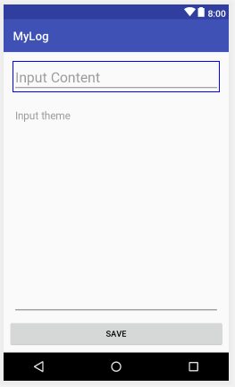

# an example of write a file into a secondary external SD card in android studio


# Write to SD card
AndroidMainfest.xml -> manifest -> before application
```xml
<uses-permission android:name="android.permission.WRITE_EXTERNAL_STORAGE" />
```
```java
public void generateNoteOnSD(Context context, String sFileName, String sBody) {
    try {
        File root = new File(Environment.getExternalStorageDirectory(), "Notes");
        if (!root.exists()) {
            root.mkdirs();
        }
        File gpxfile = new File(root, sFileName);
        FileWriter writer = new FileWriter(gpxfile);
        writer.append(sBody);
        writer.flush();
        writer.close();
        Toast.makeText(context, "Saved", Toast.LENGTH_SHORT).show();
    } catch (IOException e) {
        e.printStackTrace();
    }
}
```
# append text
I think you have to replace this line:
```java
FileOutputStream fileOutputStream = new FileOutputStream(file);
```
with this:
```java
FileOutputStream fileOutputStream = new FileOutputStream(file, true);
```
where if you set boolen true, you say that you want to write appending text.

# Android 在软键盘弹出时将布局上移，不掩盖控件
http://www.jianshu.com/p/8c98df35d368
可以在`AndroidMainfest.xml`给该`Activity`加入一个属性`windowSoftInputMode`，就可以让系统在弹起键盘时自动调整界面。如果没有`stateHidden`会自动弹出键盘。
```xml
<activity android:name=".ui.activity.LoginActivity"
android:windowSoftInputMode="adjustResize|stateHidden" />
```

# acquire different SD card directory
```java
// Primary physical SD-CARD (not emulated)
final String rawExternalStorage = System.getenv("EXTERNAL_STORAGE");
File root = new File(Environment.getExternalStorageDirectory(), "05fanNotes");
// All Secondary SD-CARDs (all exclude primary) separated by ":"
final String rawSecondaryStoragesStr = System.getenv("SECONDARY_STORAGE");
File root = new File(System.getenv("SECONDARY_STORAGE"));
// Primary emulated SD-CARD
final String rawEmulatedStorageTarget = System.getenv("EMULATED_STORAGE_TARGET");
```

# source
[Read text file from assets folder in Android Studio](https://www.youtube.com/watch?v=1CHDASXojNQ)
[File google](https://developer.android.com/reference/java/io/File.html)
[彻底理解android中的内部存储与外部存储](http://blog.csdn.net/u012702547/article/details/50269639)
[Android必备知识点- Android文件（File）操作](http://www.imooc.com/article/14521)
